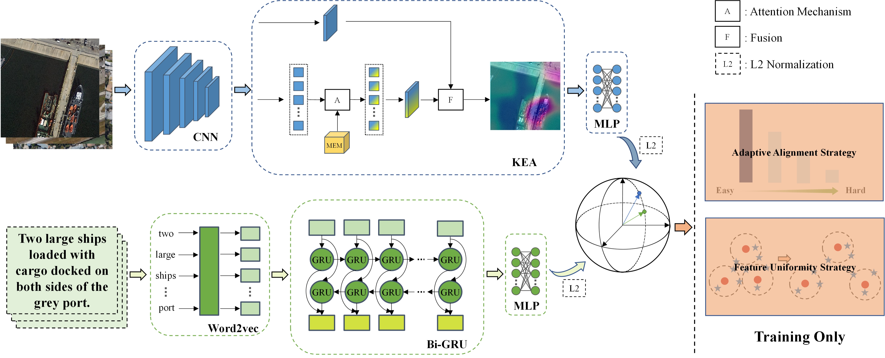
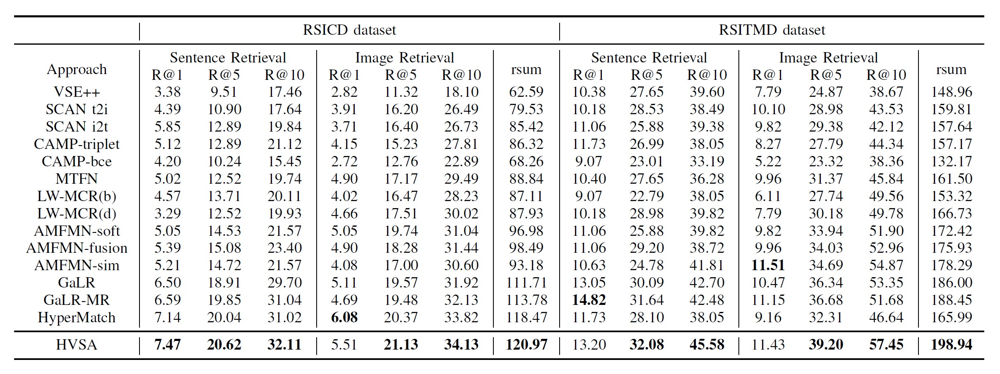

# HVSA

Official PyTorch implementation for [**Hypersphere-Based Remote Sensing Cross-Modal Text–Image Retrieval via Curriculum Learning**](https://ieeexplore.ieee.org/document/10261223?source=authoralert).



## News :tada:
- 📣 Oct 2023 - The code of HVSA has been released.
- 📣 Oct 2023 - Codes is coming soon (before Nov). 
- 📣 Sep 2023 - Paper Accepted by TGRS.


## Dependencies
Download the dataset files and pre-trained models. Files about seq2vec are from [here](https://github.com/xiaoyuan1996/AMFMN/tree/master/AMFMN).

Install dependencies using the following command.

```
pip install -r requirements.txt
```

## Dataset preparation
All experiments are based on [RSITMD](https://github.com/xiaoyuan1996/AMFMN/tree/master/RSITMD) and [RSICD](https://github.com/201528014227051/RSICD_optimal) datasets,
### RSICD

We followed the same split provided by [AMFMN](https://github.com/xiaoyuan1996/AMFMN/tree/master/AMFMN/data/rsicd_precomp).
Dataset splits can be found in [data/rsicd_raw](data/rsicd_raw).

### RSITMD
We followed the same split provided by [AMFMN](https://github.com/xiaoyuan1996/AMFMN/tree/master/AMFMN/data/rsitmd_precomp).
Dataset splits can be found in [data/rsitmd_raw](data/rsitmd_raw).

## Train
```bash
# RSITMD Dataset
python train.py --config configs/HVSA_rsitmd.yaml
```
## Evaluate
```bash
# RSITMD Dataset
python eval.py --config configs/HVSA_rsitmd.yaml
```
## Performance



## Citing HVSA
If you find this repository useful, please consider giving a star :star: and citation:
```
@ARTICLE{10261223,
  author={Zhang, Weihang and Li, Jihao and Li, Shuoke and Chen, Jialiang and Zhang, Wenkai and Gao, Xin and Sun, Xian},
  journal={IEEE Transactions on Geoscience and Remote Sensing}, 
  title={Hypersphere-Based Remote Sensing Cross-Modal Text–Image Retrieval via Curriculum Learning}, 
  year={2023},
  volume={61},
  number={},
  pages={1-15},
  doi={10.1109/TGRS.2023.3318227}}
```
## Acknowledgment
The implementation of HVSA relies on resources from <a href="https://github.com/fartashf/vsepp">VSE++</a>, and <a href="https://github.com/xiaoyuan1996/AMFMN">AMFMN</a>. We thank the original authors for their open-sourcing. 